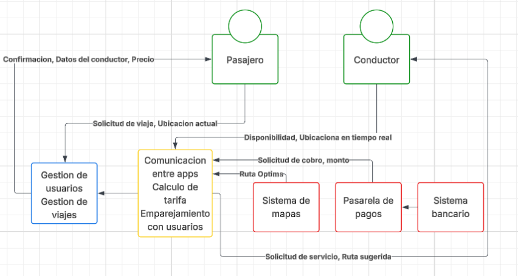
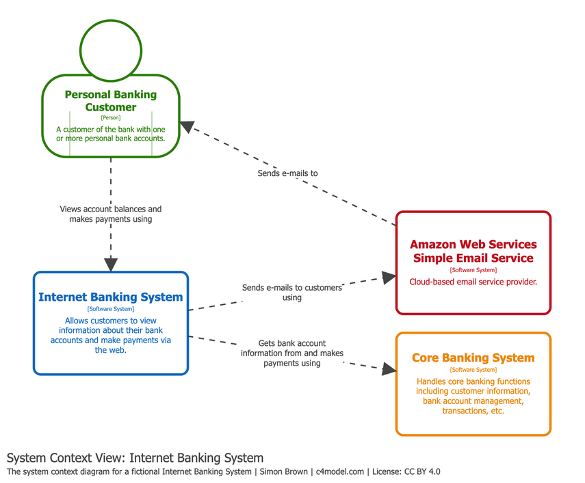
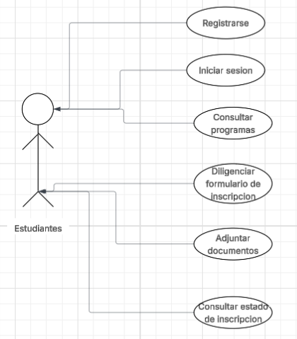

# Diagrama de contexto

**UBER**

**Ejemplos de diagrama de contexto**

El componente de color azul y amarillo en el diagrama representa los
sistemas de software que se van a construir - Aveces solo se representa en
uno, el componente rojo es todo sistema de software que ya existe y es
externo a la implementacion

# Ejercicio Analisis de requerimientos

- Nombre

Inscripcion en linea a programa academico

- Descripcion

Permite a un aspirante registrarse en la plataforma institucional y diligenciar el formulario de inscripcion
a una carrera ofrecida por la universidad.

- Ejecucion

El aspirante ingresa a la pagina web, selecciona la opcion "Inscripciones", completa el formulario cons sus datos personales,
academicos y adjunta los documentos requeridos.

- Actor principal

Aspirante

- Precondiciones 

El sistema web debe estar disponible
El aspirante debe tener accesos  a internet
Deben existir programas academicos habilitados para inscripcion.

- Datos de entrada

Nombres y apellidos
Tipo y numero de documento
Fecha de nacimiento
Correo electronico
Telefono
Direccion
Programa academico seleccionado
Resultados pruebas Saber 11
Documentos adjuntos.

- Datos de salida

Confirmacion de inscripcion exitosa 
Numero de inscripcion
Correo de confirmacion

**FLUJO BASICO**

1. El aspirante ingresa a la pagina web.
2. Selecciona "inscripcion"
3. EL sistema muestra el formulario
4. El aspirante completa los datos requeridos
5. Adjunta documentos solicitados.
6. Presiona "Enviar"
7. El sistema valida la informacion
8. El sistema registra la inscripcion
9. Se muestra mensaje de confirmacion

**FLUJOS ALTERNOS**

- Datos incompletos
- Documento invalido
- Fallo de conexion

**DIAGRAMA DE CASOS DE USO**

**REGLAS DE NEGOCIO**

1. El aspirante puede inscribirse a programas activos.
2. Todos los campos obligatorios deben completarse
3. Los documentos deben estar en formato PDF
4. El sistema solo permite una inscripcion activda por programa
5. El correo electronico deber ser unico
6. La edad minima debe cumplir con normativa institucional.

**REQUERIMIENTOS FUNCIONALES**

RF1: El sistema debe permitir al aspirante registrarse
RF2: El sistema debe mostrar la oferta academica disponible
RF3: El sistema debe permitir diligenciar el formulario de inscripcion
RF4: El sistema debe permitir adjuntar documentos en PDF
RF5: El sistema debe validar campos obligatorios
RF6: El sistema debe generar numero unico de inscripcion
RF7: El sistema debe enviar correo de confirmacion

**REQUERIMIENTOS NO FUNCIONALES**

RNF1: El sistema debe estar disponible 99% del tiempo
RNF2: El tiempo de respuesta no debe superar 3 segundos
RNF3: El sistema debe proteger los datos personales segun la Ley de Proteccion de Datos
RNF4: El sistema debe usar conexion
RNF5: El sistema debe permitir acceso desde dispositivos moviles
RNF6: El sistema debe soportar minimo 500 usuarios simultaneos en temporada alta