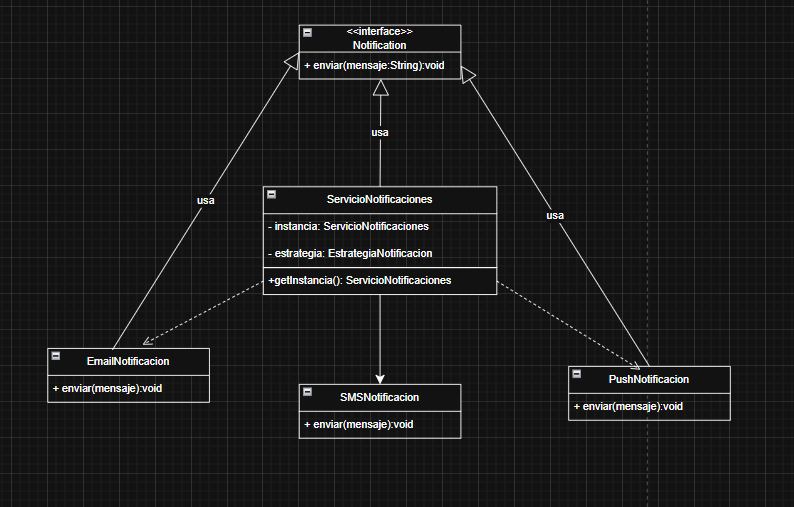
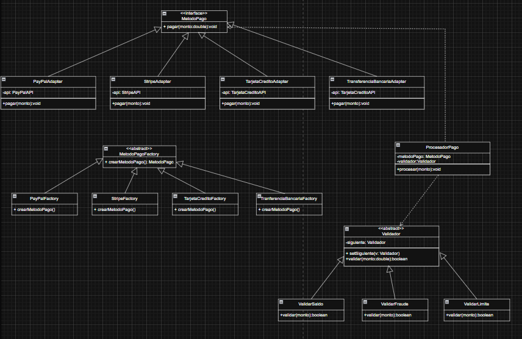
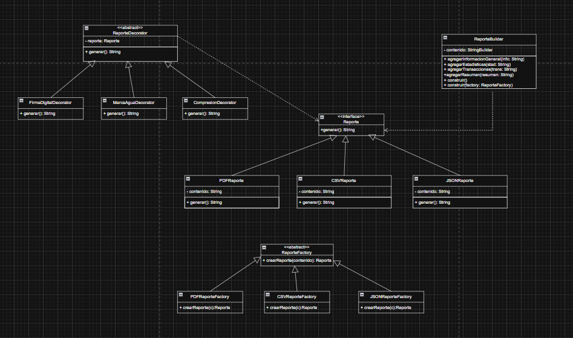
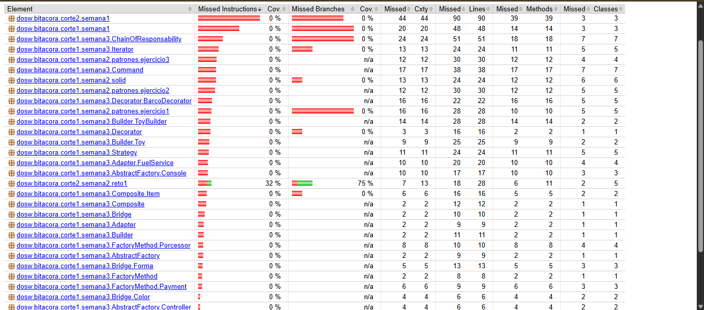
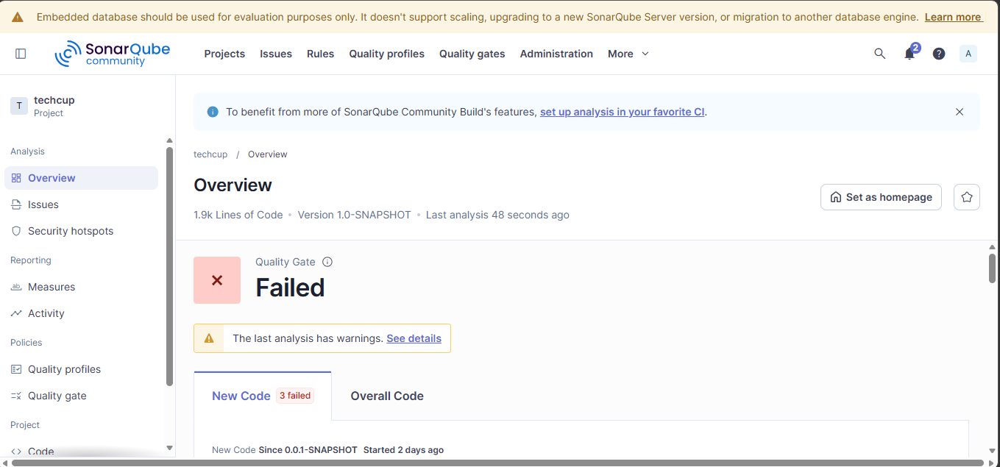
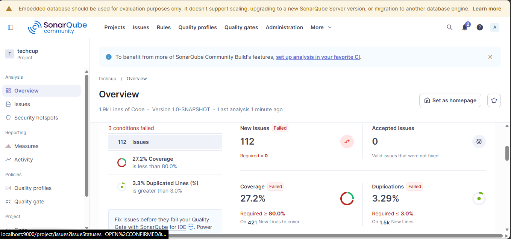

# Patrones de Diseño

### Ejercicio 1: Sistema de notificaciones

- **Strategy**

Tipo: Comportamiento

Uso: Permite cambiar dinamicamente el tipo de notificacion(Email, SMS, Push) en tiempo de ejecucion sin modificar el codigo del cliente.

- **Singlenton**

Tipo: Creacional

Uso: Se implementa en el servicio de notificaciones para garantizar que exista una unica instancia encargada del envio en todo el sistema.

##### Diagrama de clases

El sistema permite agregar nuevos canales de notificacion y cambiar su comportamiento sin afectar la logica existente.

### Ejercicio 2: Sistema de procesamiento de pagos

- **Adapter**

Tipo: Estructural

Uso: Permite integrar diferentes proveedores de pago (Paypal, Stripe, Tarjeta, Transferencia) adaptando sus APIs a una interfaz comun.

- **Chain of Responsability**

Tipo: Comportamiento

Uso: Se utiliza para ejecutar validaciones en cadena (saldo, fraude, limite), donde cada una decide si el proceso continua o se detiene.

- **Factory Method**

Tipo: Creacional

Uso: Permite crear dinamicamente los metodos de pago sin acoplar el sistema a clases concretas, facilitando la extension con nuevos proveedores.

##### Diagrama de clases

El sistema es flexible, permitiendo agregar nuevos metodos de pago y validaciones sin modificar el codigo existente.

### Ejercicio 3: Sistema de reportes

- **Builder**

Tipo: Creacional

Uso: Permite construir reportes paso a paso agregando diferentes secciones como informacion general, estadisticas, transacciones y resumen.

- **Factory Method**

Tipo: Creacional

Uso: Se utiliza para crear distintos formatos de reporte (PDF, CSV, JSON) sin acoplar el sistema a implementaciones especificas.

- **Decorator**

Tipo: Estructural

Uso: Permite extender los reportes agregando funcionalidades adicionales como firma digital, marca de agua y compresion sin modificar la estructura base.

##### Diagrama de clases

El sistema permite generar reportes flexibles, extensibles y personalizables, tanto en contenido como en formato, funcionalidades adicionales.

### JaCoCo

### SonarQube

## Ejercicio Biblioteca 

| Biblioteca | https://github.com/LauLau1214/DOSW-Library.git |

## Ejercicio del preparcial

| Preparcial | https://github.com/LauLau1214/ECI-SportLife.git |